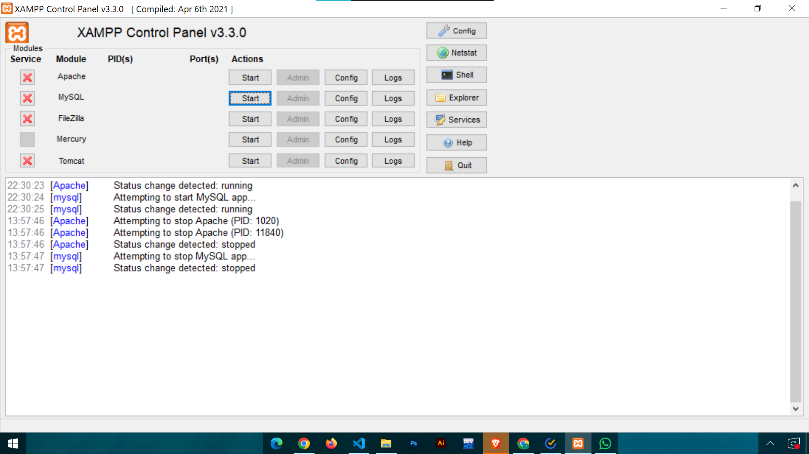
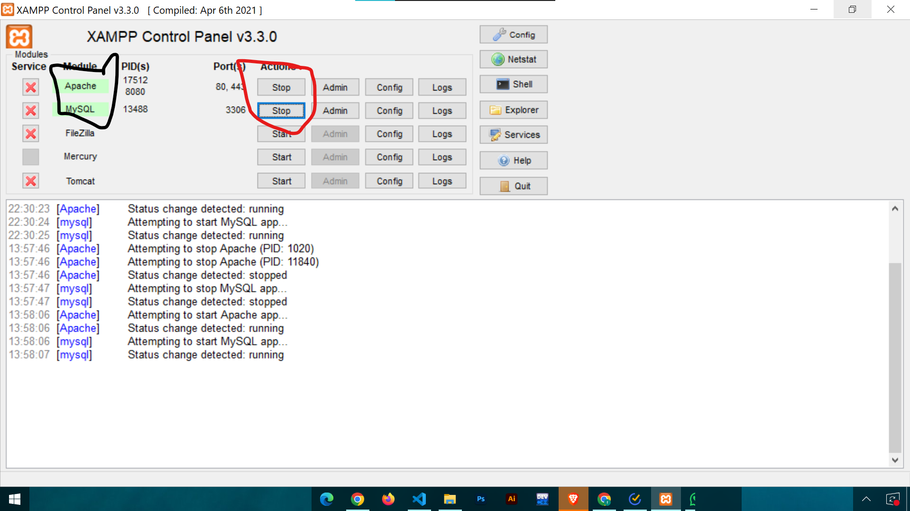
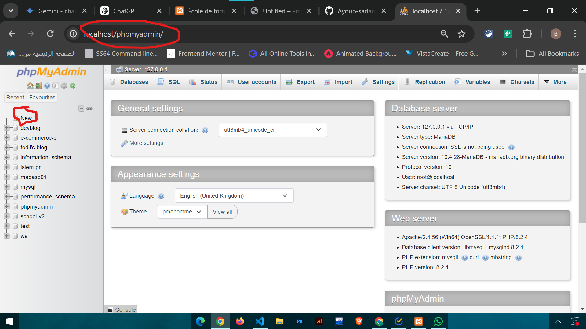
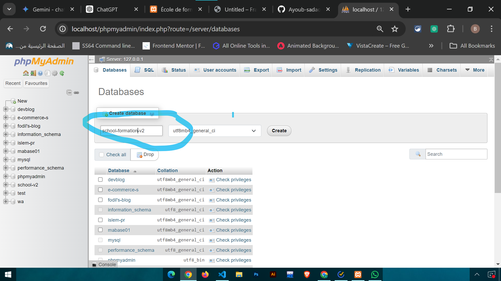
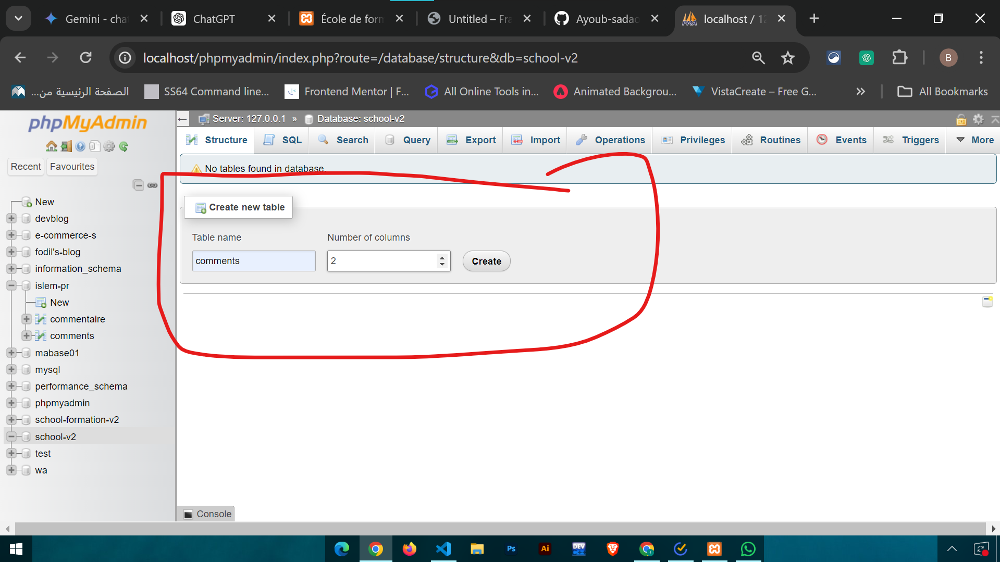
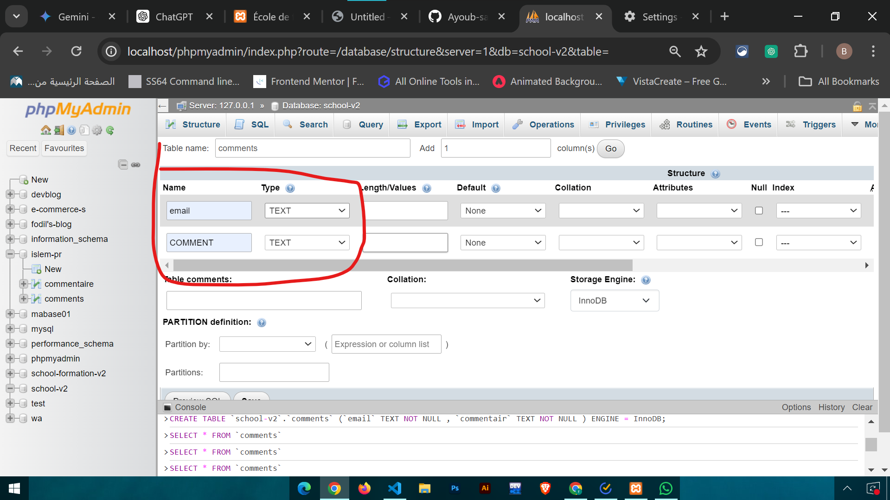

# school-formation-v3

## remark

- this file and the folder 'how-to' in lib should be deleted before presenting the project

- this file is to read and understand how to setup a server with xamp and connect it with our project

# install xamp:

##### download link :

    - https://www.apachefriends.org/download.html

# project folder

- after installing xamp go and copy-past the project folder in 'C:\xampp\htdocs' or where over is your folder

## start server

- open xamp control panel

  

- start the apache and mysql server

  

### remark :

- if you get any bug or servers can't start contact me ((the green color will be red))

# connect to database

### create a db

go to this url

     http://localhost/phpmyadmin/

- you will get this
  

- tap on new to create new db

- will show you you this :
  

- choose a name to your database
  and create it

### create new table

- now let create a new table to handle comments
  
- put the name of table must be "comments"
- put the number of column =2
- and create
- this will show
  
- put email and type text
- put COMMENTS and the type text
- then create

### remark :

- the names of table and column should be the same or you need to change it in code also

### connect to vscode

- open your folder with vscode
- open database.php file in php folder
- and change the dbname to your database name
  
